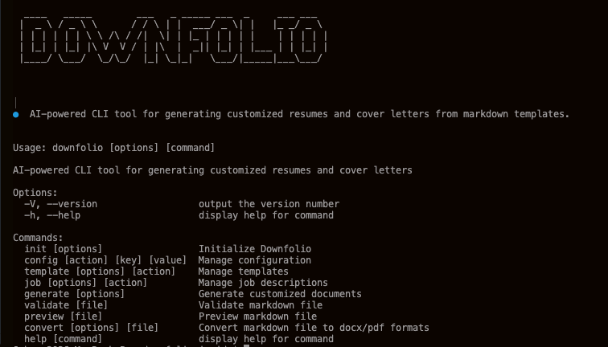

# Downfolio

[](https://opensource.org/licenses/MIT)
[](https://www.typescriptlang.org/)
[](https://nodejs.org/)

Markdown + Portfolio = Downfolio

AI-powered CLI tool for generating customized resumes and cover letters from markdown templates based on your career experience.



## ✨ Features

- 📝 **Markdown-first** - Write your base templates in simple markdown
- 🤖 **AI-powered** - Automatically customize content for each job application
- 🎯 **ATS-friendly** - Optimized for Applicant Tracking Systems
- 📦 **Multiple formats** - Export to Markdown, DOCX, and PDF
- 🔄 **Reusable templates** - Create once, customize for every job
- 🎨 **Beautiful CLI** - Interactive prompts guide you through every step
- 🔐 **Privacy-first** - Your data stays local, only job descriptions sent to AI

## 📋 Table of Contents

- [Recommended Use](#recommended-use)
- [Installation](#installation)
- [Quick Start](#quick-start)
- [Using API Keys](#using-api-keys)
- [Development](#development)
- [Testing](#testing)
- [FAQ](#faq)
- [Troubleshooting](#troubleshooting)
- [Contributing](#contributing)
- [License](#license)

## Recommended Use

1. Create base templates for cover letter and resumes based on your REAL career experience. (Don't Use AI for this step!)
2. For every job you want to apply for use Downfolio to generate custom resumes and cover letters from your base templates using a job description.
3. Review the output carefully and ensure it reflects your work experience.
4. Edit as needed.
5. Apply to the job.

## Installation

### Prerequisites

Downfolio requires the following dependencies for document conversion:

**Required for DOCX and PDF conversion:**
- **Pandoc** - Document converter
  ```bash
  # macOS
  brew install pandoc

  # Other platforms: https://pandoc.org/installing.html
  ```

**Required for PDF conversion only:**
- **PDF Engine** - One of the following:
  - **BasicTeX** (recommended, ~100MB)
    ```bash
    # macOS
    brew install --cask basictex
    # Then restart your terminal or run:
    eval "$(/usr/libexec/path_helper)"
    ```
  - **MacTeX** (full distribution, ~4GB)
    ```bash
    brew install --cask mactex-no-gui
    ```
  - **wkhtmltopdf** (alternative)
    ```bash
    brew install wkhtmltopdf
    ```

**Note:** Markdown format requires no dependencies. DOCX requires only Pandoc. PDF requires both Pandoc and a PDF engine.

### Install Downfolio

```bash
pnpm install
pnpm run build
pnpm link  # Makes 'downfolio' command available globally when testing
```

## Quick Start

1. **Initialize the project:**
   ```bash
   downfolio init
   ```
   This creates `~/Downfolio/` directory with the following structure:
   ```
   ~/Downfolio/
   ├── config.yaml      # API keys and settings
   ├── Templates/       # Your resume and cover letter templates
   ├── Jobs/            # Job descriptions you're applying to
   └── Output/          # Generated customized documents
   ```

2. **Copy example templates (optional but recommended):**
   ```bash
   cp examples/resume_template.md ~/Downfolio/Templates/
   cp examples/cover_letter_template.md ~/Downfolio/Templates/
   ```
   
   Then customize them with YOUR real experience. See [examples/README.md](./examples/README.md) for detailed guidance.

### Creating Templates

Templates are versions of your cover letters or resumes. Use different templates based on your job search needs.

```text
Examples: Engineering_Resume.md, Product_Manager_Cover_Letter.md, VP_of_Marketing_Resume.md, etc
```

1. **Start with example templates (recommended):**
   ```bash
   # Copy and customize the examples
   cp examples/resume_template.md ~/Downfolio/Templates/my_resume.md
   cp examples/cover_letter_template.md ~/Downfolio/Templates/my_cover_letter.md
   ```
   
   Then edit these files to include YOUR actual experience. See [examples/README.md](./examples/README.md) for tips.

2. **Or create template files from scratch:**
   - Create your resume or cover letter templates as markdown files directly in `~/Downfolio/Templates/`
   - Example: `~/Downfolio/Templates/my_resume_template.md`

3. **Register a template:**
   ```bash
   downfolio template add
   ```
   - Selects from markdown files already in `~/Downfolio/Templates/`
   - Registers it so you can use it for generation
   - Templates are reusable across all job applications

## Creating Jobs

Jobs are specific descriptions about a job you are applying for.  This is usually found at the beginning of a Job post. This metadata is used to customize each output file.

Example:

```text
Role Overview:
- We’re looking for a Senior Product Manager to help build and scale agentic AI systems at ABC Co. In this role, you will work closely with Engineering, Applied AI/ML, Design, and customer-facing teams to ship production-ready agentic capabilities and make them successful in real customer environments.This role emphasizes execution, customer impact, and production rigor, with opportunities to grow into broader platform ownership over time.

What You’ll Do:
- Define and execute product initiatives for agentic AI systems, with a focus on measurable customer and business outcomesOwn significant parts of the agentic system lifecycle, including orchestration, decisioning, evaluation, and iteration.
- Contribute to building a repeatable framework for launching, evaluating, and improving agentic capabilities across customers
- Help define how agentic systems are measured and improved in production, balancing autonomy with safety and reliability
- Partner closely with Engineering, Applied AI/ML, Design, and Solutions teams to ship production-ready systemsWork directly with customers to understand workflows, requirements, and success criteria
- Drive customer-informed prioritization by staying close to live deployments and real usage patternsSupport best practices for agent evaluation, iteration, and safe rolloutRepresent the product in customer conversations, demos, and feedback sessions
```

4. **Create job description files:**
   - Copy/paste job descriptions from job posts into a new markdown files directly in `~/Downfolio/Jobs/`
   - Example: `~/Downfolio/Jobs/netflix_engineer_job.md`

5. **Register a job:**
   ```bash
   downfolio job add
   ```
   - **Interactive prompts**:
     - Select from markdown files already in `~/Downfolio/Jobs/`
     - Registers it so you can use it for generation
     - Jobs are reusable across all job applications

6. **Generate new documents:**
   ```bash
   downfolio generate
   ```
   - **Interactive prompts**:
     - Select which job to use (from registered jobs)
     - Select which template(s) to use (resume and/or cover letter)
     - Choose output formats (markdown, docx, pdf)
   - AI will customize the template(s) based on the job description
   - Customized documents are saved to `~/Downfolio/Output/<output-name>/`

### Best practices

- Review AI-generated content before submitting
- Edit markdown files and regenerate if needed
- Keep outputs organized by company/role
- Version control the markdown files if desired

## Using API Keys

### Open AI

1. Go to https://platform.openai.com/api-keys
2. Create a new API key

**Set minimal permissions!**
- Select "Restricted" and enable only:
- Under Model Capabilities select Chat Completions - Request
- You don't need any other permissions.

### Anthropic
1. Go to https://platform.claude.com/
2. Create a new API key


## Development

```bash
# Build TypeScript
pnpm run build

# Run in development mode
pnpm run dev

# Watch for changes
pnpm run watch
```

## Testing

```bash
# Run all tests
pnpm test

# Run tests in watch mode
pnpm test:watch
```

See [tests/README.md](./tests/README.md) for detailed testing documentation.

## 📚 FAQ

### Do I need to pay for API usage?

Yes, Downfolio uses OpenAI or Anthropic APIs which are paid services. However, the cost per generation is typically $0.01-0.05 per document. You'll need to add a payment method to your API provider account.

### Is my data private?

Yes! Your resume and cover letter templates are stored locally on your machine. Only the job description and relevant portions of your experience are sent to the AI provider for customization.

### Can I use this without AI?

Not currently. The core feature is AI-powered customization. However, you can manually edit the markdown templates without using the generate command.

### Which AI provider should I use?

Both OpenAI (GPT-4) and Anthropic (Claude) work well. Try both and see which produces better results for your use case. Downfolio will automatically use whichever API key is configured.

### Can I customize the AI prompts?

Not through the CLI currently, but you can fork the project and modify the prompts in `src/lib/ai.ts`.

### Does this work offline?

Partially. You can create and edit templates offline, but the `generate` command requires an internet connection to call the AI APIs.

### What markdown features are supported?

Standard markdown is fully supported:
- Headings (`#`, `##`, `###`)
- Lists (ordered and unordered)
- Bold and italic
- Links
- Code blocks

Frontmatter is optional and used for metadata.

### Can I export to other formats?

Currently: Markdown, DOCX, and PDF. Other formats (HTML, LaTeX) can be added using Pandoc. See [CONTRIBUTING.md](./CONTRIBUTING.md) if you'd like to add support.

### How do I update Downfolio?

```bash
cd /path/to/downfolio
git pull
pnpm install
pnpm run build
```

## 🔧 Troubleshooting

Having issues? Check out the [TROUBLESHOOTING.md](./TROUBLESHOOTING.md) guide for solutions to common problems:

- Installation issues
- API key problems
- Document generation errors
- Configuration issues
- And more...

## 🤝 Contributing

Contributions are welcome! Please see [CONTRIBUTING.md](./CONTRIBUTING.md) for guidelines.

### Quick Start for Contributors

```bash
git clone https://github.com/jpvajda/downfolio.git
cd downfolio
pnpm install
pnpm run build
pnpm test
```

## 📄 License

MIT © [John P Vajda](https://github.com/jpvajda)

## 🙏 Acknowledgments

- [Clack](https://github.com/natemoo-re/clack) - Beautiful CLI prompts
- [Pandoc](https://pandoc.org/) - Universal document converter
- [OpenAI](https://openai.com/) & [Anthropic](https://anthropic.com/) - AI providers

---

**Need help?** Open an issue on [GitHub](https://github.com/jpvajda/downfolio/issues)

